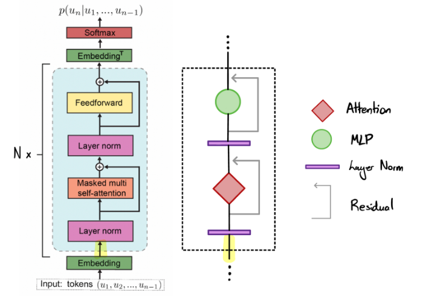

<div align="left" >
  <p align="left">  </p>
</div>

# GPT-2 (124M) from Scratch and Training on Arabic Dataset

This repository contains a Jupyter Notebook for building and training a GPT-2 (124M) model from scratch using only torch and training it on an Arabic dataset. This project follows the tutorial by Andrej Karpathy, adapting the steps to work with the Arabic language.



## Overview

The goal of this project is to create a GPT-2 model specifically trained on Arabic text. The notebook provides a step-by-step guide to:
- Setting up the environment
- Preparing the dataset
- Building the model
- Training the model
- Evaluating the model's performance

## Notebook Details

 The notebook `ArabianGPT2-124M-FromScratch.ipynb` contains the following sections:

1. **Setup and Installation**:
    - Installation of necessary libraries including `tiktoken`.

2. **Data Preparation**:
    - Loading and preprocessing Arabic text data for training.

3. **Model Configuration**:
    - Setting up the GPT-2 model configuration for training from scratch.

4. **Training the Model**:
    - Code to train the model using the prepared dataset. This includes setting up the training loop, loss calculation, and optimizer configuration.

5. **Evaluation and Testing**:
    - Code to evaluate the trained model on a test dataset and generate sample texts.

6. **Saving the Model**:
    - Saving the trained model for future use


## Requirements

To run the notebook, you will need the following libraries and dependencies:

- Python 3.x
- Torch
- Transformers (Hugging Face)
- NumPy
- Pandas
- Jupyter Notebook

You can install the required libraries using pip:

```bash
pip install tensorflow transformers numpy pandas jupyter
```

## Instructions

1. Clone this repository to your local machine:

```bash
git clone https://github.com/MohamedRagabAbbas/ArabianGPT2-124M-FromScratch.git
cd ArabianGPT2-124M-FromScratch
```

2. Install the required libraries (if not already installed):

```bash
pip install -r requirements.txt
```

3. Open the Jupyter Notebook:

```bash
jupyter notebook "ArabianGPT2-124M-FromScratch.ipynb"
```

4. Follow the steps in the notebook to set up the environment, prepare your dataset, build the GPT-2 model, and train it on the Arabic text.

## Acknowledgments

This project follows the tutorial by Andrej Karpathy. Special thanks to him for providing an excellent guide on building and training GPT-2 models.

## License

This project is licensed under the MIT License - see the [LICENSE](LICENSE) file for details.

Thank you for using this repository! Happy coding!
